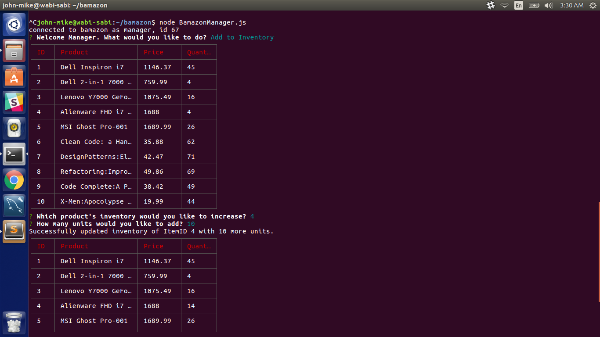

# Bamazon node.js app
Bamazon is a Node JS app which mimics an Amazon type of store.  This app is written in Node.JS and uses a local MySQL database.

## Technologies Used
* JavaScript
* Node.JS
* MySQL
* npm dependencies:
	* inquirer
	* mysql
	* cli-table

## Screenshots

### Customer View

### Manager View

## Built With
* SublimeText 3
* MySQL

## Author
&copy; 2016 John-Mike Marquardt [Github](https://github.com/codemarq) | [jmmarquardt.com](https://jmmarquardt.com) | [LinkedIn](https://www.linkedin.com/in/jmmarquardt)
:neckbeard:
